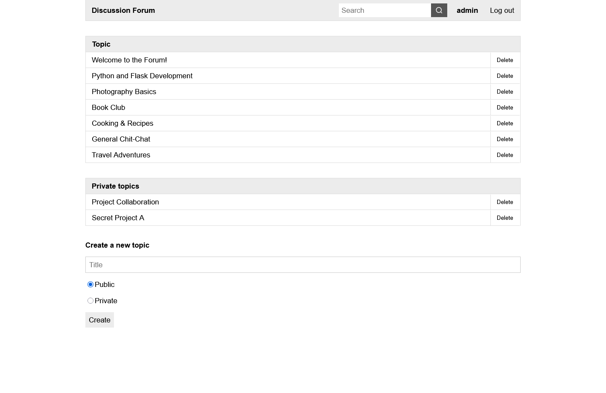
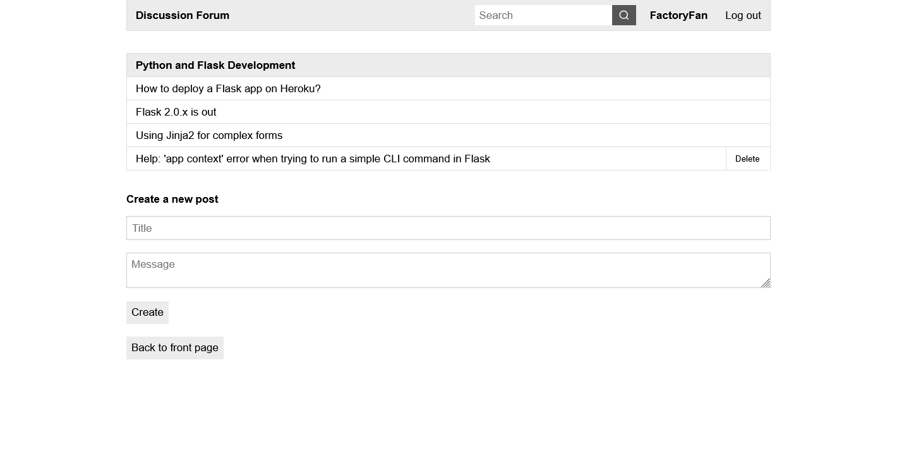
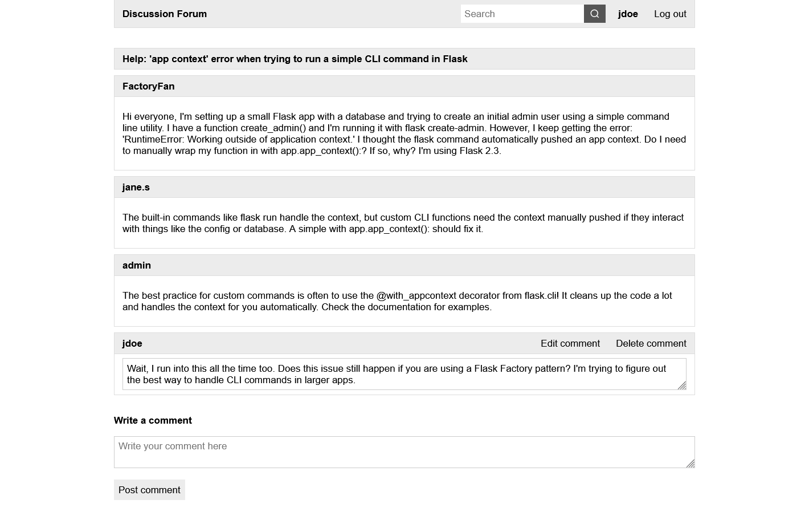
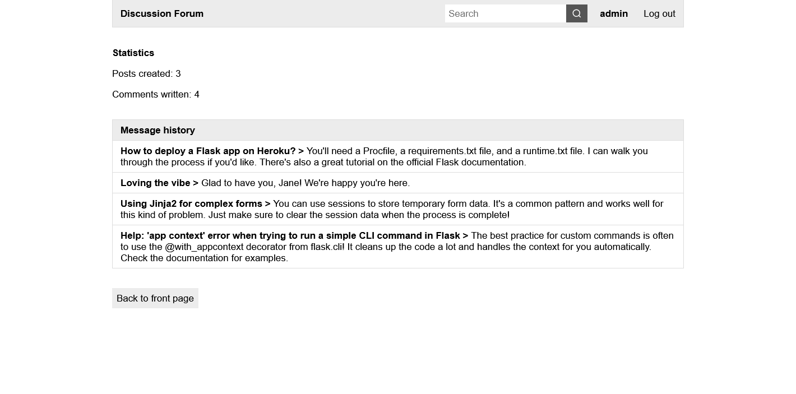
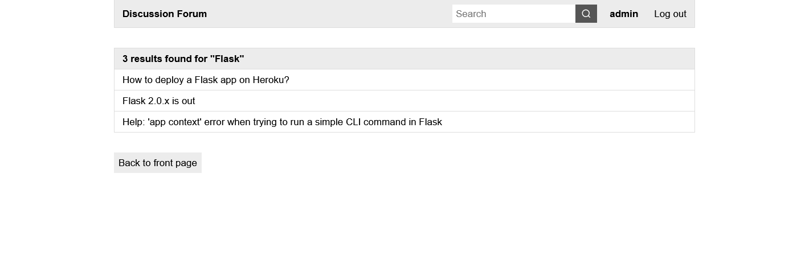
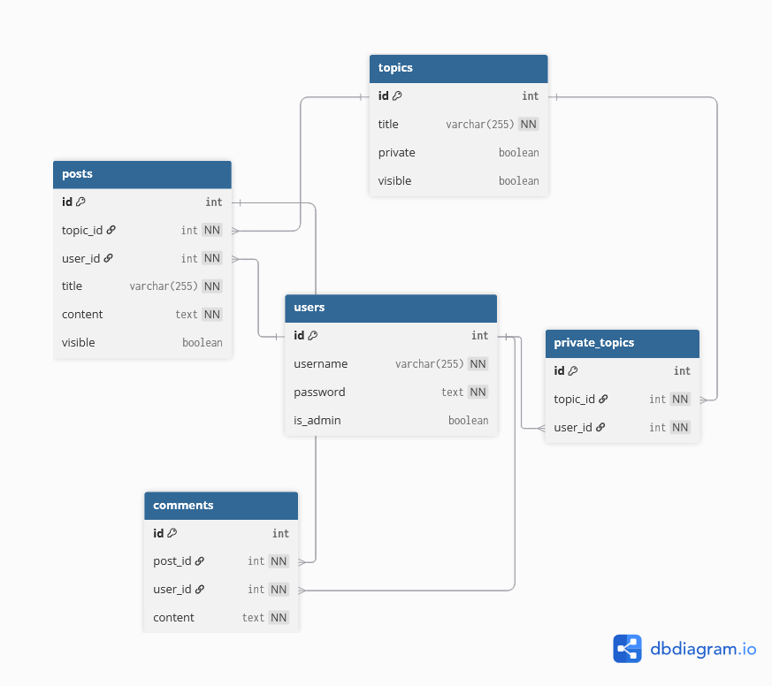

# Discussion Forum – Databases & Web Programming Project

## Overview

A web-based discussion forum application where users can discuss various topics by posting messages. Developed as part of the University of Helsinki databases and web programming project course.

## Tech stack

- **Frontend:** HTML, CSS
- **Backend:** Python, Flask
- **Database:** PostgreSQL

**Note:** Raw SQL queries are used for database interactions instead of the Flask-SQLAlchemy ORM. This choice was made purposefully to practice and demonstrate SQL skills.

## How to use

To clone and run this application, you'll need [Git](https://git-scm.com/) and [Python](https://www.python.org/) installed on your computer. From your terminal:

```
# Clone this repository
$ git clone https://github.com/jarkmaen/discussion-forum.git

# Go into the project directory
$ cd discussion-forum

# Create a virtual environment
$ python -m venv venv

# Activate the virtual environment
$ source venv/bin/activate

# Install dependencies
$ pip install -r requirements.txt

# Create a .env file with the following:
DATABASE_URI=<your_postgresql_uri>
SECRET_KEY=<your_secret_key>

# Run the application
$ flask run
```

Once the application is running, open [http://localhost:5000](http://localhost:5000) in your browser.

To test out the administrative tools, a default admin account is automatically created when the database is initialized for the first time. The credentials are:

- Username: `admin`  
- Password: `admin`

## Screenshots

| Home page (admin view)     | Topic page with posts           | Post page with comments         |
|----------------------------|---------------------------------|---------------------------------|
|  |  |  |

| User profile page          | Search results                  | Database schema                 |
|----------------------------|---------------------------------|---------------------------------|
|  |  |  |

## Documentation

- [Requirements specification](documentation/requirements-specification.md)