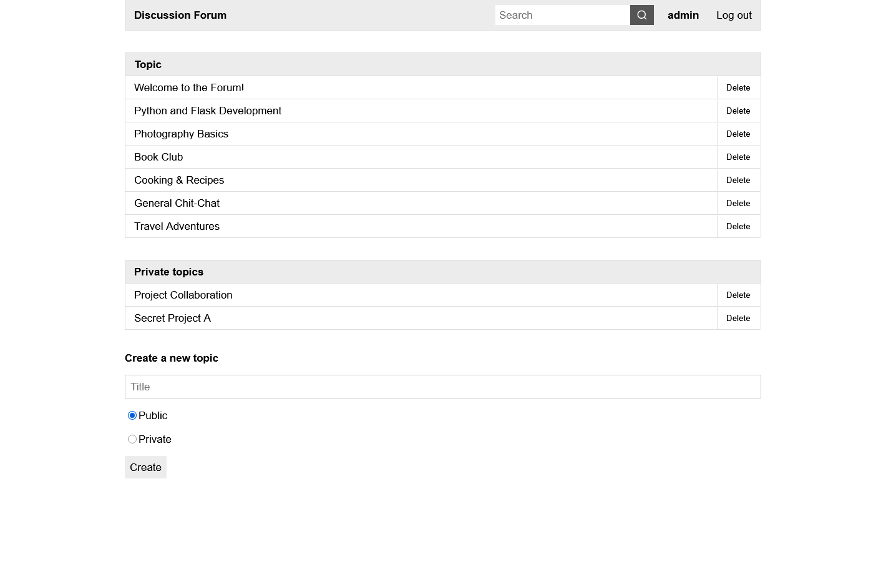
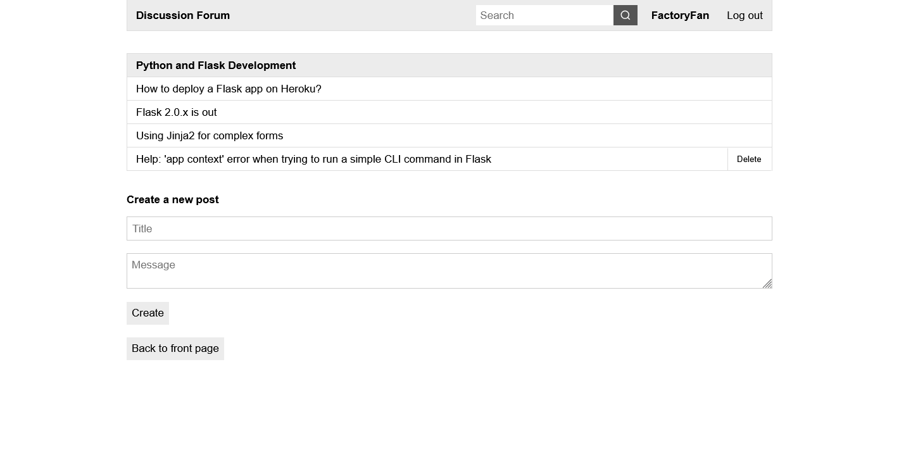
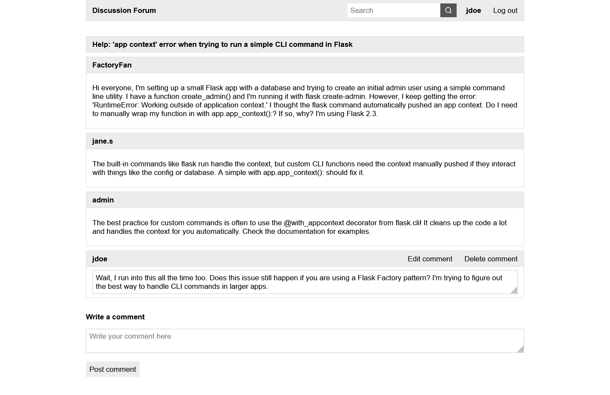
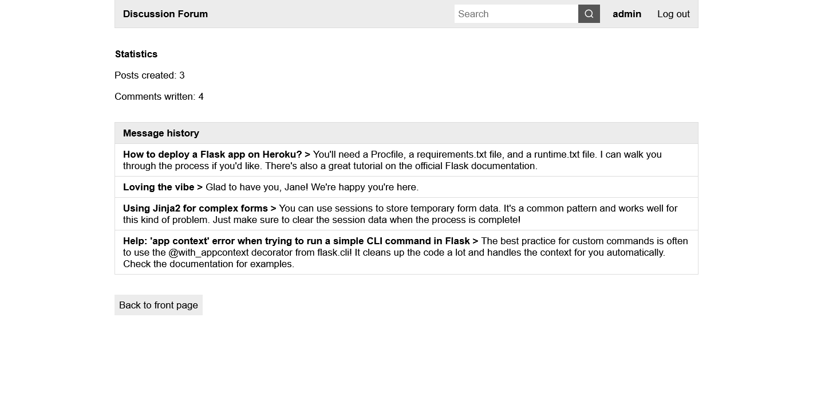
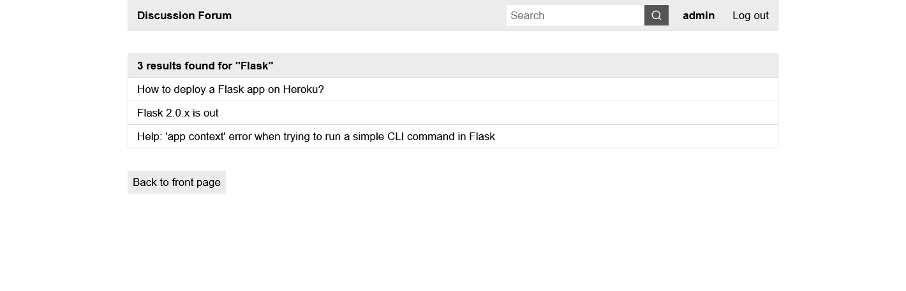
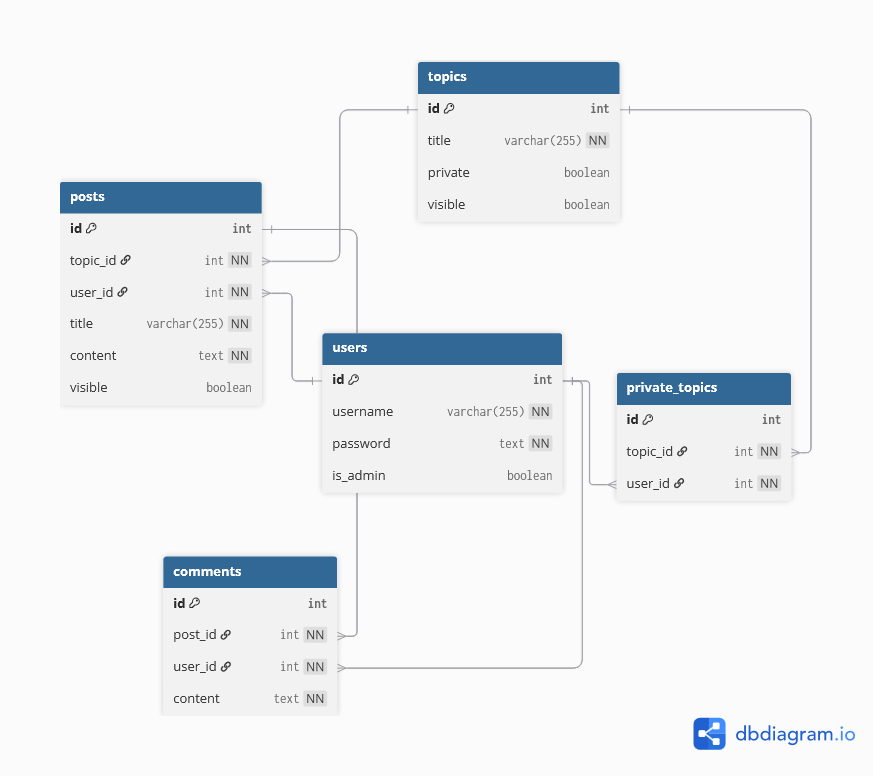

# Discussion Forum - Databases & Web Programming Project

## Overview

A discussion forum web application where users can create posts and add comments within predefined topics. Developed as part of the University of Helsinki databases and web programming project course.

## Tech stack

- **Frontend:** HTML, CSS
- **Backend:** Python, Flask
- **Database:** PostgreSQL

Note: Raw SQL queries are used for database interactions instead of Flask-SQLAlchemy ORM. This choice was made on purpose to practice and demonstrate SQL skills.

## Documentation

- [Requirements specification](documentation/requirements-specification.md)

## How to use

To clone and run this application, you'll need to have both [Git](https://git-scm.com/) and [Python](https://www.python.org/) installed on your computer. From your terminal:

```
# Clone this repository and go to the project directory
$ git clone https://github.com/jarkmaen/discussion-forum.git
$ cd discussion-forum

# Create a virtual environment
$ python -m venv venv

# Activate the virtual environment
$ source venv/bin/activate

# Install dependencies
$ pip install -r requirements.txt

# Create a .env file with the following:
DATABASE_URI=<your_postgresql_uri>
SECRET_KEY=<your_secret_key>

# Start the application
$ flask run
```

Once it is running, open http://localhost:5000 in your browser.

To test out the administrative tools, a default admin account is created automatically when the database is initialized for the first time. The credentials are:

- Username: `admin`
- Password: `admin`

## Screenshots

| Home page (admin view)                           | Topic page with posts                              | Post page with comments                          |
| ------------------------------------------------ | -------------------------------------------------- | ------------------------------------------------ |
|  |  |  |

| User profile page                                      | Search results                             | Database schema                                              |
| ------------------------------------------------------ | ------------------------------------------ | ------------------------------------------------------------ |
|  |  |  |
